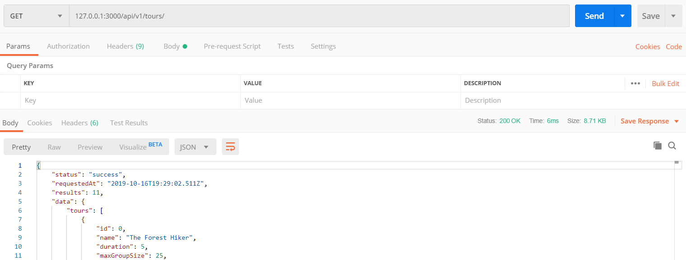

## Setting up Express and Basic Routing
- ```npm init```
- ```npm i express@4```
- create app.js file - put all Express configurations inside this folder.
```JavaScript
// Use Express:
const express = require('express');

// Define app variable and assign express to it: 
// this add methods that we will use to the app variable
const app = express();

// Define a route:
// when the route is hit the callback function specifies the outcome
// pass in request and response arguments to the callback function
app.get('/', (request, response) => {
  response.status(200).send('Hello from the server side!');
});

const port = 3000;
// Use listen() method to create a server:
// pass in a port and a callback function which will be called as soon as the server starts listening.
app.listen(port, () => {
  console.log(`App running on port ${port}...`);
});

/* Run the application
OUTPUT:
[nodemon] to restart at any time, enter `rs`
[nodemon] watching dir(s): *.*
[nodemon] watching extensions: js,mjs,json
[nodemon] starting `node app.js`
App running on port 3000...
*/
```
- Test the API with **Postman**:

You could also run the application and test it in the browser. Note that Postman does not render HTML.  
Instead of responding text with ```send()``` method, we can also responde with JSON. We don't have to manually define the content-type with express; some result headers are automatically send back by express.
```JavaScript
app.get('/', (request, response) => {
  response
    .status(200)
    .json({ message: 'Hellow from the server side!', app: 'Natours' });
});
```  
Here we have a JSON object response in Postman.

<br/>

## APIs and RESTful API Design
- Building API's using the RESTful Architecture
- Application Programming Interface is a piece of software that can be used by another piece of software, in order to allow applications to talk to each other.
  - Browser's DOM JavaScript API
  - With OOP, when exposing methods to the public, we're creating an API
  - fs or http API's, . . .
  - Web API
### The REST Architecture
*a way of building Web API's in a logical way making them easy to consume.*  
#### REST Principles

1. Separate API into logical ***resources*** -> Resource: Object or representation of something, which has data associated to it. Any information that can be *named*(not a verb) can be a resource.  
   Example:  
   tours, users, review,...
<br/>

2. Expose structured, ***resource-based URLs*** -> make available the data using some structured URLs that the client can send some requests to.  
   Example:  
   https://www.natours.com/addNewTour (/addNewTour is called ENDPOINT - Entpoints will send back different data to the client)
<br/>

3. Use ***HTTP methods*** -> Endpoints should be names and not verbs. Use http methods and names for the endpoint.  
   Example:  
   /getTours   - ```GET```     /tours  : Read  
   /addNewTour - ```POST```    /tours  : Create  
   /updateTour - ```PUT```(sent the entire object) / ```PATCH```(part of object) /tours  : Update  
   /deleteTour - ```DELETE```  /tours  : Delete
<br/>

4. Send data as ***JSON*** -> We can send JSON without formatting; we can also do some simple response formatting before sending it to the client. The standard that we are using is called **JSend**. We create a new object; add a status message to it; and add the data into an object called data.  
   This formatting is called **Enveloping**- common practive to mitigate some security issues. There are also other response formatting standarts like JSOPN:API, OData JSON Protocol, ...
<br/>

5. Be ***stateless*** -> All state is handled on the client. (State refers to a piece of data in the application that might change overtime; ex: loggedIn, currentPage) This means that each request must contain all the information necessary to process a certain request. The server should not have to remember previous requests.
<br/>

## Handling GET Requests

- In this project we will be able to see tours, book tours, create accounts, look at reviews from other users. The graphical interface will be build later.
- Start the project by working with the data - *Create the API.*
```JavaScript
// Use File System
const fs = require('fs');

// Use Express
const express = require('express');

// Assign to Variable app
const app = express();

// Read Data - (tours) array of JSON objects; in top-level code; not in the route handler.
// Top level will be executed only once right after the application startup.
const tours = JSON.parse(
  fs.readFileSync(`${__dirname}/dev-data/data/tours-simple.json`)
);

// Define a Route:
app.get('/api/v1/tours', (request, response) => { // the callback function is called 'The Route Handler';  
  // only callback functions will run inside the Event Loop. In here we cannot have any blocking code!
  // read the data before we can send it to the client(in top-level code).
  // Send Data to Client:
  response.status(200).json({
    // we want to send back JSend standard format:
    status: 'success',
    results: tours.length, // only add when we sending multiple objects(array)
    data: {
      tours
    }
  });
});

const port = 3000;
// Create a Server; callback function will be called as soon as the server starts listening.
app.listen(port, () => {
  console.log(`App running on port ${port}...`);
});
```
Run the project and test the api in Postman:

<br/>

## Handling POST Requests
*add a new tour to the data-set*
- Create a new Route
- To send data from the client to the server on the request, add a **middleware** to the top-level - ```app.use(express.json());```.  
- *Middleware:* can manipulate the request or response object, or execute any other code. It is mostly used for request. 
```JavaScript
// Top-level Code:

// Create a Middleware (function that can modify incoming request data)
app.use(express.json());

// Define a new Route to add a new Tour with the HTTP POST Request
app.post('/api/v1/tours', (request, response) => {
  console.log(request.body);
  response.send('Done'); // always need to send response to finish the cycle.
});
```
- For testing purposes, specify the Body in Postman - (raw JSON the data that we want to send to the server.) and Send data:
  
Console Output:  
```
[nodemon] starting `node app.js`
App running on port 3000...
{ name: 'Test api', duration: 10, difficulty: 'easy' }
```
#### Example:
Create a new tour and add it to the json file  
```JavaScript
// Define a new Route to add a new Tour with the HTTP POST Request
app.post('/api/v1/tours', (request, response) => {
  // the id of an object is handled by the db - takes id of last object and adds 1
  const newId = tours[tours.length - 1].id + 1;
  const newTour = Object.assign({ id: newId, price: 230 }, request.body);

  // push the new tour to the tours array
  tours.push(newTour);
  fs.writeFile(
    `${__dirname}/dev-data/data/tours-simple.json`,
    JSON.stringify(tours),
    err => {
      response.status(201).json({   // 201 Created Status
        status: 'success',
        data: {
          tour: newTour
        }
      });
    }
  );
});
```  
Add additional data in Postman for testing purpose:
  
<br/>

## Responding to URL Parameters
- Define Parameters in the URL
- Read these Parameters and respond to them
#### Example:  
- implement retreiving only one tour.
- the end piece of the URL is where we want a variable that acts as a unique identifier.
- we want to read this variable from the URL - define a route which can accept a variable.
- create the variable with a colon in the URL with any name  ```app.get('/api/v1/tours/:id', (request, response) => {```  
- we can access the variable with the assigned value to it with the params property; params are all the variables in the URL - ```request.params```.
- Note that we can create as many variables as we want in the URL with a **/:variable_name**, and define the values by adding them to the enpoint. 
  <br/>
  We could also make the parameters *optional* by adding a **?** to the end of the variable name, like **/:variable_name?**. This way if we no longer have to specify it at the endpoint.  
```JavaScript
// Define a Route to GET ONE Tour by defining a variable:
app.get('/api/v1/tours/:id', (request, response) => {
  console.log(request.params); 
  response.status(200).json({
    status: 'success'
  });
});
```  
Run the server and make a GET request in Postman with a value of 5 ```127.0.0.1:3000/api/v1/tours/5```, and see the OUTPUT in console for the params:
```
[nodemon] starting `node app.js`
App running on port 3000...
{ id: '5' }  --> here is the variable with the assigned value
```
- Next, get the tour from the JSON file with that id.  
  Convert the input at the endpoint to a number.  
  Use the ```find()``` array function and pass in a callback function.  
  Make sure the value passed in is a valid id, if not send back a 404  
  In a real world senario user input should always be validated.  
  Respond the tour data.  
```JavaScript
// Define a Route to GET ONE Tour by defining a variable:
app.get('/api/v1/tours/:id', (request, response) => {
  console.log(request.params);

  const id = request.params.id * 1; // converts string to number.

  if (id > tours.length) {
    return response.status(404).json({
      status: 'fail',
      message: 'Invalid ID'
    }); // exit the function
  }
  // we could also try to get the tour first,
  // and then test and see if we got a tour:
  // if(!tour){
  
  const tour = tours.find(element => element.id === id);
  response.status(200).json({
    status: 'success',
    data: {
      tour
    }
  });
});
```  
Run the server and make a GET request in Postman with a value of 5 ```127.0.0.1:3000/api/v1/tours/5```; This will respond with the tour of id 5.
  
<br/>

## Handling PATCH Requests
- to update data
- first expect a patch request to come in and create the URL for it
- to update tour - get tour from json file,update it, and save it.
- For this example we are only sending back a simple response.
```JavaScript
// Update data with patch - properties on the object
app.patch('/api/v1/tours/:id', (request, response) => {
  if (request.params.id * 1 > tours.length) {
    response.status(404).json({
      status: 'fail',
      message: 'Invalid ID'
    });
  }
  response.status(200).json({
    status: 'success',
    data: {
      tour: '<Updated tour here...>'
    }
  });
});
```
Run the server and make a PATCH request in Postman with a value of 5 and change the value of a property in the Body section ```127.0.0.1:3000/api/v1/tours/5```; The output will only display a message with the updated tour here.

<br/>

## Handling DELETE Requests
- in this example we are not implementing the deleting from the source but only displaying a message, because we are only dealing with a file.  
- the response for a DELETE request is usually 204. This means *No Content*. We don't send data back, instead we send null.
```JavaScript
// Delete data
app.delete('/api/v1/tours/:id', (request, response) => {
  if (request.params.id * 1 > tours.length) {
    response.status(404).json({
      status: 'fail',
      message: 'Invalid ID'
    });
  }
  response.status(204).json({
    status: 'success',
    data: null
  });
});
```  
Run the server and make a DELETE request in Postman with a value of 5  ```127.0.0.1:3000/api/v1/tours/5```; The output in postman is no content at all.  
<br/>


## Refactoring Routes
- refactor the code so that the routes are together and the handler functions are also together.
- export the handler functions into their own functions. 
```JavaScript
// CRUD Functions All Together:

// GET ALL Tours functions:
const getAllTours = (request, response) => {
  response.status(200).json({
    status: 'success',
    results: tours.length,
    data: {
      tours
    }
  });
};

// GET A Tour function:
const getTour = (request, response) => {
  console.log(request.params);

  const id = request.params.id * 1;

  if (id > tours.length) {
    return response.status(404).json({
      status: 'fail',
      message: 'Invalid ID'
    });
  }
  const tour = tours.find(element => element.id === id);
  response.status(200).json({
    status: 'success',
    data: {
      tour
    }
  });
};

// CREATE a Tour function:
const createTour = (request, response) => {
  const newId = tours[tours.length - 1].id + 1;
  const newTour = Object.assign({ id: newId, price: 230 }, request.body);

  tours.push(newTour);
  fs.writeFile(
    `${__dirname}/dev-data/data/tours-simple.json`,
    JSON.stringify(tours),
    err => {
      response.status(201).json({
        status: 'success',
        data: {
          tour: newTour
        }
      });
    }
  );
};

// UPDATE a Tour function
const updateTour = (request, response) => {
  if (request.params.id * 1 > tours.length) {
    response.status(404).json({
      status: 'fail',
      message: 'Invalid ID'
    });
  }
  response.status(200).json({
    status: 'success',
    data: {
      tour: '<Updated tour here...>'
    }
  });
};

// DELETE a Tour function
const deleteTour = (request, response) => {
  if (request.params.id * 1 > tours.length) {
    response.status(404).json({
      status: 'fail',
      message: 'Invalid ID'
    });
  }
  response.status(204).json({
    status: 'success',
    data: null
  });
};

// ROUTES - use route() method with the URL and attach HTML methods with the same route.

app
  .route('/api/v1/tours')
  .get(getAllTours)
  .post(createTour);
app
  .route('/api/v1/tours/:id')
  .get(getTour)
  .patch(updateTour)
  .post(deleteTour);
```  
<br/>

## Middleware and the Request-Response Cycle
*Express is a routing and middleware web framework that has minimal functionality of its own: An Express application is essentially a series of middleware function calls.*
- **Middleware** functions are functions that have access to the **request object**(req), the **response object**(res), and the next middleware function in the application's request-response cycle. 
- Middleware functions can 
  - manipulate the request or response object, 
  - execute any other code, 
  - end the request-response cycle, or 
  - call the next middleware function in the stack. 
- It is called middleware because it is a function that is executed in the middle of receiving the request and sending the response. 
- We can say "in Express, everything is middleware" (even routers)".  
- It is mostly used for request - to send data from the client to the server on the request, add a **middleware** to the top-level - ```app.use(express.json());```.   
Other example for middleware are parsing body, logs, setting headers, router,... 
- All the middleware functions that we use together in the app is called the **Middleware Stack**.
- The order of the middleware functions is defined in the code, which is important in express.  
Think of the whole process as going through a pipeline, where the request and response objects are created at the beginning, and will go through each middleware where they will be processed. 
- At the end of each middleware function, a ```next()``` function is called. 
- The last middleware function is usually a route handler that uses the ```send()``` function to send the request back to the client. The whole process is called the **Request-Response Cycle**.  
    
<br/>

*An Express application can use the following types of middleware:*
1. *Application-level middleware:*  
  Bind application-level middleware to an instance of the app object by using the ```app.use()``` and ```app.METHOD()``` functions, where METHOD is the HTTP method of the request that the middleware function handles (such as GET, PUT, or POST) in lowercase.  

This example shows a middleware function with no mount path. The function is executed every time the app receives a request.
```JavaScript
var app = express()

app.use(function (req, res, next) {
  console.log('Time:', Date.now())
  next()
})
```  
This example shows a middleware function mounted on the /user/:id path. The function is executed for any type of HTTP request on the /user/:id path.
```JavaScript
app.use('/user/:id', function (req, res, next) {
  console.log('Request Type:', req.method)
  next()
})
```  
This example shows a route and its handler function (middleware system). The function handles GET requests to the /user/:id path.
```JavaScript
app.get('/user/:id', function (req, res, next) {
  res.send('USER')
})
```   
To skip the rest of the middleware functions from a router middleware stack, call ```next('route')``` to pass control to the next route.  
NOTE: next('route') will work only in middleware functions that were loaded by using the app.METHOD() or router.METHOD() functions.  
This example shows a middleware sub-stack that handles GET requests to the /user/:id path.  
```JavaScript
app.get('/user/:id', function (req, res, next) {
  // if the user ID is 0, skip to the next route
  if (req.params.id === '0') next('route')
  // otherwise pass the control to the next middleware function in this stack
  else next()
}, function (req, res, next) {
  // send a regular response
  res.send('regular')
})

// handler for the /user/:id path, which sends a special response
app.get('/user/:id', function (req, res, next) {
  res.send('special')
})
```  
2. *Router-level Middleware:*  
  Router-level middleware works in the same way as application-level middleware, except it is bound to an instance of ```express.Router()```.  
Load router-level middleware by using the ```router.use()``` and ```router.METHOD()``` functions.  

The following example code replicates the middleware system that is shown above for application-level middleware, by using router-level middleware:
```JavaScript
var app = express()
var router = express.Router()

// a middleware function with no mount path. This code is executed for every request to the router
router.use(function (req, res, next) {
  console.log('Time:', Date.now())
  next()
})

// a middleware sub-stack shows request info for any type of HTTP request to the /user/:id path
router.use('/user/:id', function (req, res, next) {
  console.log('Request URL:', req.originalUrl)
  next()
}, function (req, res, next) {
  console.log('Request Type:', req.method)
  next()
})

// a middleware sub-stack that handles GET requests to the /user/:id path
router.get('/user/:id', function (req, res, next) {
  // if the user ID is 0, skip to the next router
  if (req.params.id === '0') next('route')
  // otherwise pass control to the next middleware function in this stack
  else next()
}, function (req, res, next) {
  // render a regular page
  res.render('regular')
})

// handler for the /user/:id path, which renders a special page
router.get('/user/:id', function (req, res, next) {
  console.log(req.params.id)
  res.render('special')
})

// mount the router on the app
app.use('/', router)
```  
3. *Error-handling Middleware:*  
  Define error-handling middleware functions in the same way as other middleware functions, except with four arguments instead of three, specifically with the signature (err, req, res, next)):
```JavaScript
app.use(function (err, req, res, next) {
  console.error(err.stack)
  res.status(500).send('Something broke!')
})
```
4. *Built-in middleware:*  
  Express has the following built-in middleware functions:

  * express.static serves static assets such as HTML files, images, and so on.
  * express.json parses incoming requests with JSON payloads. NOTE: Available with Express 4.16.0+
  * express.urlencoded parses incoming requests with URL-encoded payloads. NOTE: Available with Express 4.16.0+
5. *Third-party middleware:*  
  Use third-party middleware to add functionality to Express apps. (more details in later section)  
  The following example illustrates installing and loading the cookie-parsing middleware function cookie-parser.
```JavaScript
 // -- $ npm install cookie-parser
var express = require('express')
var app = express()
var cookieParser = require('cookie-parser')

// load the cookie-parsing middleware
app.use(cookieParser())
```
< br/>

## Creating Our Own Middleware
- To create our own middleware use ```app.use``` and pass in a callback function that we want to add to our middleware stack.
- in each middleware function, we have access to the request and response and also the next() function that we can add as an argument to the callback function -```request, response, next```.
- Route functions are also middleware that get only executed for certain URL's
- The middleware that we define are going to be applied for every single request. Don't add middleware after the route handlers - they send a result and therefore end the request-response cycle.

```JavaScript
// Create a Middleware
app.use(express.json());

// Create a Middleware
app.use((request, response, next) => {
  console.log("Hello from the middleware");
  // next function moves to the next middleware.
  next();
});

// Create a Middleware (manipulate the request function)
app.use((request, response, next) => {
  // Define a Property on the Request Object, (sending back the date/time)
  request.requestTime = new Date().toISOString();
  next();
 });
 
 // use the properties in the the route handlers:
 // get ALL Tours functions:
const getAllTours = (request, response) => {
  console.log(request.requestTime); // use the Property Defined in Middleware
  response.status(200).json({
    status: 'success',
    requestedAt: request.requestTime, // send back the Property Defined in Middleware
    results: tours.length,
    data: {
      tours
    }
  });
};

```  
Run the server and get request in postman; OUTPUT:
  

## Using 3rd-Party Middleware
- Popular login middleware "Morgan" helps us see requests data in the console.
- *Add to package.json:*```npm i morgan``` - is not a dev-dependency but a regular dependency. 
- *Require in code:*```const morgan = require('morgan');```
- *Use middleware:* ```app.use(morgan('dev'));``` the passeed in argument describes how we want the log in to look like.  
Run the application, and make a request in postman. The data about the request will be displayed in the console:  
``` GET /api/v1/tours/ 200 4.592 ms - 8703 ```  
- Here  is a list of middleware that is recommended in express;  
 
The Express middleware modules listed here are maintained by the Expressjs team:  

| Middleware module  | Description	 | Replaces built-in function (Express 3) |
| ----------------- | ------------- | --------------------------------- |
| body-parser      | 	Parse HTTP request body. | express.bodyParser |
| compression |	Compress HTTP responses.	| express.compress |
| connect-rid	| Generate unique request ID.|	NA|
| cookie-parser |	Parse cookie header and populate req.cookies. |  express.cookieParser |
| cookie-session |	Establish cookie-based sessions.	| express.cookieSession |
| cors	| Enable cross-origin resource sharing (CORS) with various options.|	NA |
| csurf	| Protect from CSRF exploits.	| express.csrf |
| errorhandler |	Development error-handling/debugging.|	express.errorHandler |
| method-override |	Override HTTP methods using header.	| express.methodOverride |
| morgan | HTTP request logger. |	express.logger |
| multer	| Handle multi-part form data.	| express.bodyParser |
| response-time	| Record HTTP response time.	| express.responseTime |
| serve-favicon	| Serve a favicon.	| express.favicon |
| serve-index	| Serve directory listing for a given path. |	express.directory |
| serve-static	| Serve static files.	| express.static |
| session	| Establish server-based sessions (development only). |	express.session |
| timeout |	Set a timeout period for HTTP request processing. | express.timeout |
| vhost	| Create virtual domains.	| express.vhost |

<br/>
These are some additional popular middleware modules:  

| Middleware module	        | Description          |
| ------------- |--------------| 
|   cls-rtracer    | 	Middleware for CLS-based request id generation. An out-of-the-box solution for adding request ids into your logs.		| 
|  connect-image-optimus     | 		Optimize image serving. Switches images to .webp or .jxr, if possible.	| 
|   express-debug    | 		Development tool that adds information about template variables (locals), current session, and so on.	| 
|   express-partial-response    | 	Filters out parts of JSON responses based on the fields query-string; by using Google API’s Partial Response.		| 
|   express-simple-cdn    | 	Use a CDN for static assets, with multiple host support.		| 
|    express-slash   | 	Handles routes with and without trailing slashes.		| 
|   express-stormpath    | 	User storage, authentication, authorization, SSO, and data security.		| 
|  express-uncapitalize     | 	Redirects HTTP requests containing uppercase to a canonical lowercase form.		| 
|   helmet    | 	Helps secure your apps by setting various HTTP headers.			| 
|   join-io    | 		Joins files on the fly to reduce the requests count.		| 
|   passport    | 	Authentication using “strategies” such as OAuth, OpenID and many others. See http://passportjs.org/ for more information.			| 
|    static-expiry   | 		Fingerprint URLs or caching headers for static assets.	| 
| view-helpers      | 	Common helper methods for views.  |
|   sriracha-admin	    | 	Dynamically generate an admin site for Mongoose.

<br/>

#### Implementing the "Users" Routes
In this application, we will implement routes for user rescourse; user accounts, user roles  
To do so, add the routes, the responses for the get/post/... requests, and the functions for these request methods.

```JavaScript
// add the routes
app
  .route('/api/v1/users')
  .get(getAllUsers)
  .post(createUser);
app
  .route('/api/v1/users/:id')
  .get(getUser)
  .patch(updateUser)
  .delete(deleteUser);

// next, create the functions for the http request calls(implement later)
// get all users:
const getAllUsers = (req, res) => {
  res.status(500).json({
    status: 'error',
    message: 'This route is not yet defined!'
  });
};
// // get one user:
. . . 
```  
<br/>

#### Creating and Mounting Multiple Routers
- create multiple routers and use a process called Mounting
- our goal is to *separate code into multiple files* - a separate file for the user routes; one for the tour routes; and different files for the handlers as well.  
- the four different routes that we have are kind of on the same router - the router is the app object. If we want to seperate these routes into two different files, we need to create a router, save it to a variable; and use it with that variable name instead of app.
- Create a sub-application; this is how we connect the routers with the application(by using it as a middleware) - ```app.use('/api/v1/tours', tourRouter);``` This process is called **Mounting Router** - mounting a router onto a route.
```JavaScript
// create new router for the tours
const tourRouter = express.Router();

// use that router:
tourRouter
  .route('/')
  .get(getAllTours)
  .post(createTour);
tourRouter
  .route('/:id')
  .get(getTour)
  .patch(updateTour)
  .delete(deleteTour);

// use the router as a middleware (Mounting a Router):
app.use('/api/v1/tours', tourRouter);


// create a new router for the users
const userRouter = express.Router();

// use that router:
userRouter
  .route('/')
  .get(getAllUsers)
  .post(createUser);
userRouter
  .route('/:id')
  .get(getUser)
  .patch(updateUser)
  .delete(deleteUser);

// use the router as a middleware:
app.use('api/v1/users', userRouter);
```  

<br/>

#### Refactor the Application - A Better File Structure

- Create a new folder - "routes" with two files - "tourRoutes.js" and "userRoutes.js"
- copy and paste the routes into these files 
- export the routes from the files  
 
*tourRoutes.js* file:  
```JavaScript
// import the express module
const express = require('express');

// Read Data (tours) - an array of JSON objects inside the dev-data folder.
const tours = JSON.parse(
  fs.readFileSync(`${__dirname}/dev-data/data/tours-simple.json`)
);

// create new router for the tours
const router = express.Router();

// use that router:
router
  .router('/')
  .get(getAllTours)
  .post(createTour);
router
  .router('/:id')
  .get(getTour)
  .patch(updateTour)
  .delete(deleteTour);

// when we have only one thing to export we use module.export
module.exports = router;
```  
*userRoutes.js* file:
```JavaScript
// import the express module
const express = require('express');

// create a new router for the users
const router = express.Router();

// use that router:
router
  .route('/')
  .get(getAllUsers)
  .post(createUser);
router
  .route('/:id')
  .get(getUser)
  .patch(updateUser)
  .delete(deleteUser);

// when we have only one thing to export we use module.export
module.exports = router;
```


