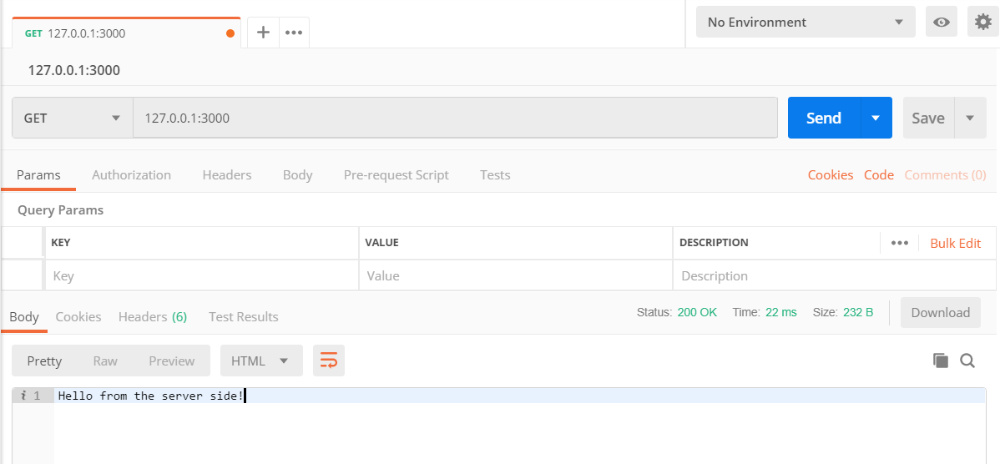
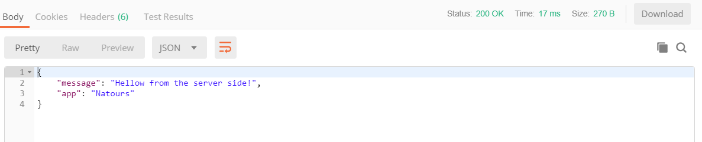
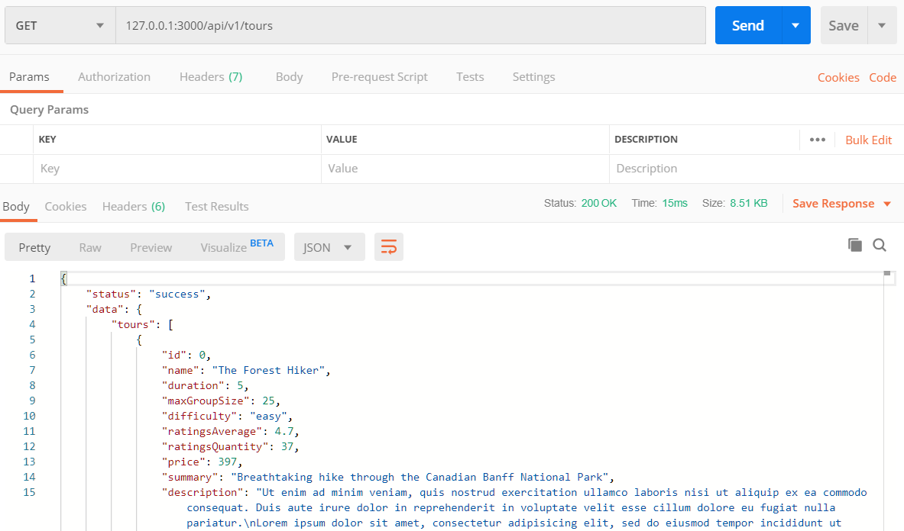
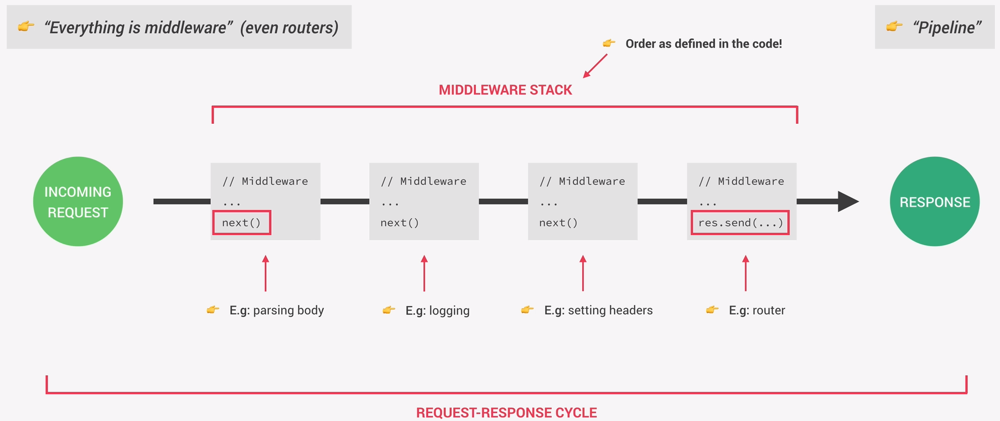
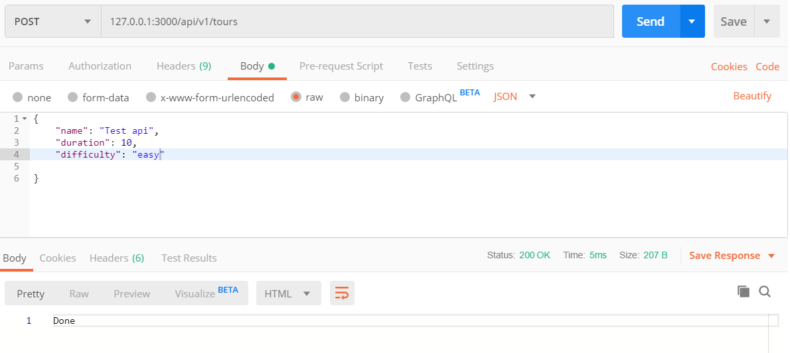
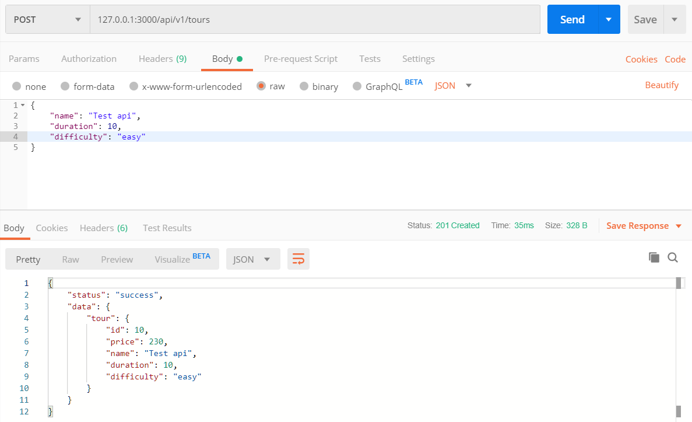
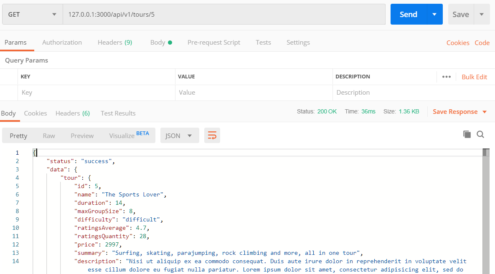

## Setting up Express and Basic Routing
- ```npm init```
- ```npm i express@4```
- create app.js file - put all Express configurations inside this folder.
```JavaScript
// Use Express:
const express = require('express');

// Define app variable and assign express to it: 
// this add methods that we will use to the app variable
const app = express();

// Define a route:
// when the route is hit the callback function specifies the outcome
// pass in request and response arguments to the callback function
app.get('/', (request, response) => {
  response.status(200).send('Hello from the server side!');
});

const port = 3000;
// Use listen() method to create a server:
// pass in a port and a callback function which will be called as soon as the server starts listening.
app.listen(port, () => {
  console.log(`App running on port ${port}...`);
});

/* Run the application
OUTPUT:
[nodemon] to restart at any time, enter `rs`
[nodemon] watching dir(s): *.*
[nodemon] watching extensions: js,mjs,json
[nodemon] starting `node app.js`
App running on port 3000...
*/
```
- Test the API with **Postman**:

You could also run the application and test it in the browser. Note that Postman does not render HTML.  
Instead of responding text with ```send()``` method, we can also responde with JSON. We don't have to manually define the content-type with express; some result headers are automatically send back by express.
```JavaScript
app.get('/', (request, response) => {
  response
    .status(200)
    .json({ message: 'Hellow from the server side!', app: 'Natours' });
});
```  
Here we have a JSON object response in Postman.

<br/>

## APIs and RESTful API Design
- Building API's using the RESTful Architecture
- Application Programming Interface is a piece of software that can be used by another piece of software, in order to allow applications to talk to each other.
  - Browser's DOM JavaScript API
  - With OOP, when exposing methods to the public, we're creating an API
  - fs or http API's, . . .
  - Web API
### The REST Architecture
*a way of building Web API's in a logical way making them easy to consume.*  
#### REST Principles

1. Separate API into logical ***resources*** -> Resource: Object or representation of something, which has data associated to it. Any information that can be *named*(not a verb) can be a resource.  
   Example:  
   tours, users, review,...
<br/>

2. Expose structured, ***resource-based URLs*** -> make available the data using some structured URLs that the client can send some requests to.  
   Example:  
   https://www.natours.com/addNewTour (/addNewTour is called ENDPOINT - Entpoints will send back different data to the client)
<br/>

3. Use ***HTTP methods*** -> Endpoints should be names and not verbs. Use http methods and names for the endpoint.  
   Example:  
   /getTours   - ```GET```     /tours  : Read  
   /addNewTour - ```POST```    /tours  : Create  
   /updateTour - ```PUT```(sent the entire object) / ```PATCH```(part of object) /tours  : Update  
   /deleteTour - ```DELETE```  /tours  : Delete
<br/>

4. Send data as ***JSON*** -> We can send JSON without formatting; we can also do some simple response formatting before sending it to the client. The standard that we are using is called **JSend**. We create a new object; add a status message to it; and add the data into an object called data.  
   This formatting is called **Enveloping**- common practive to mitigate some security issues. There are also other response formatting standarts like JSOPN:API, OData JSON Protocol, ...
<br/>

5. Be ***stateless*** -> All state is handled on the client. (State refers to a piece of data in the application that might change overtime; ex: loggedIn, currentPage) This means that each request must contain all the information necessary to process a certain request. The server should not have to remember previous requests.
<br/>

## Handling GET Requests

- In this project we will be able to see tours, book tours, create accounts, look at reviews from other users. The graphical interface will be build later.
- Start the project by working with the data - *Create the API.*
```JavaScript
// Use File System
const fs = require('fs');

// Use Express
const express = require('express');

// Assign to Variable app
const app = express();

// Read Data - (tours) array of JSON objects; in top-level code; not in the route handler.
// Top level will be executed only once right after the application startup.
const tours = JSON.parse(
  fs.readFileSync(`${__dirname}/dev-data/data/tours-simple.json`)
);

// Define a Route:
app.get('/api/v1/tours', (request, response) => { // the callback function is called 'The Route Handler';  
  // only callback functions will run inside the Event Loop. In here we cannot have any blocking code!
  // read the data before we can send it to the client(in top-level code).
  // Send Data to Client:
  response.status(200).json({
    // we want to send back JSend standard format:
    status: 'success',
    results: tours.length, // only add when we sending multiple objects(array)
    data: {
      tours
    }
  });
});

const port = 3000;
// Create a Server; callback function will be called as soon as the server starts listening.
app.listen(port, () => {
  console.log(`App running on port ${port}...`);
});
```
Run the project and test the api in Postman:

<br/>

## Handling POST Requests
*add a new tour to the data-set*
- Create a new Route
- To send data from the client to the server on the request, add a **middleware** to the top-level - ```app.use(express.json());```.  
- *Middleware:* can manipulate the request or response object, or execute any other code. It is mostly used for request. It is called middleware because it is a function that is executed in the middle of receiving the request and sending the response. We can say "in Express, everything is middleware" (even routers).  
<br/>

Examples for middleware are parsing body, logging, setting headers, router,... All the middleware together that we use in the app is called the **Middleware Stack**.
<br/>

The order of Middleware is defined in the code, which is important in express.  
Think of the whole process as going through a pipeline, where the request and response objects are created at the beginning, and will go through each middleware where they will be processed. At the end of each middleware function, a ```next()``` function is called. The last middleware function is usually a route handler that uses the ```send()``` function to send the request back to the client. The whole process is called the **Request-Response Cycle**.  
    
```JavaScript
// Top-level Code:

// Create a Middleware (function that can modify incoming request data)
app.use(express.json());

// Define a new Route to add a new Tour with the HTTP POST Request
app.post('/api/v1/tours', (request, response) => {
  console.log(request.body);
  response.send('Done'); // always need to send response to finish the cycle.
});
```
- For testing purposes, specify the Body in Postman - (raw JSON the data that we want to send to the server.) and Send data:
  
Console Output:  
```
[nodemon] starting `node app.js`
App running on port 3000...
{ name: 'Test api', duration: 10, difficulty: 'easy' }
```
#### Example:
Create a new tour and add it to the json file  
```JavaScript
// Define a new Route to add a new Tour with the HTTP POST Request
app.post('/api/v1/tours', (request, response) => {
  // the id of an object is handled by the db - takes id of last object and adds 1
  const newId = tours[tours.length - 1].id + 1;
  const newTour = Object.assign({ id: newId, price: 230 }, request.body);

  // push the new tour to the tours array
  tours.push(newTour);
  fs.writeFile(
    `${__dirname}/dev-data/data/tours-simple.json`,
    JSON.stringify(tours),
    err => {
      response.status(201).json({   // 201 Created Status
        status: 'success',
        data: {
          tour: newTour
        }
      });
    }
  );
});
```  
Add additional data in Postman for testing purpose:
  
<br/>

## Responding to URL Parameters
- Define Parameters in the URL
- Read these Parameters and respond to them
#### Example:  
- implement retreiving only one tour.
- the end piece of the URL is where we want a variable that acts as a unique identifier.
- we want to read this variable from the URL - define a route which can accept a variable.
- create the variable with a colon in the URL with any name  ```app.get('/api/v1/tours/:id', (request, response) => {```  
- we can access the variable with the assigned value to it with the params property; params are all the variables in the URL - ```request.params```.
- Note that we can create as many variables as we want in the URL with a **/:variable_name**, and define the values by adding them to the enpoint. 
  <br/>
  We could also make the parameters *optional* by adding a **?** to the end of the variable name, like **/:variable_name?**. This way if we no longer have to specify it at the endpoint.  
```JavaScript
// Define a Route to GET ONE Tour by defining a variable:
app.get('/api/v1/tours/:id', (request, response) => {
  console.log(request.params); 
  response.status(200).json({
    status: 'success'
  });
});
```  
Run the server and make a GET request in Postman with a value of 5 ```127.0.0.1:3000/api/v1/tours/5```, and see the OUTPUT in console for the params:
```
[nodemon] starting `node app.js`
App running on port 3000...
{ id: '5' }  --> here is the variable with the assigned value
```
- Next, get the tour from the JSON file with that id.  
  Convert the input at the endpoint to a number.  
  Use the ```find()``` array function and pass in a callback function.  
  Make sure the value passed in is a valid id, if not send back a 404  
  In a real world senario user input should always be validated.  
  Respond the tour data.  
```JavaScript
// Define a Route to GET ONE Tour by defining a variable:
app.get('/api/v1/tours/:id', (request, response) => {
  console.log(request.params);

  const id = request.params.id * 1; // converts string to number.

  if (id > tours.length) {
    return response.status(404).json({
      status: 'fail',
      message: 'Invalid ID'
    }); // exit the function
  }
  // we could also try to get the tour first,
  // and then test and see if we got a tour:
  // if(!tour){
  
  const tour = tours.find(element => element.id === id);
  response.status(200).json({
    status: 'success',
    data: {
      tour
    }
  });
});
```  
Run the server and make a GET request in Postman with a value of 5 ```127.0.0.1:3000/api/v1/tours/5```; This will respond with the tour of id 5.
  
<br/>

## Handling PATCH Requests
- to update data
- first expect a patch request to come in and create the URL for it
- to update tour - get tour from json file,update it, and save it.
- For this example we are only sending back a simple response.
```JavaScript
// Update data with patch - properties on the object
app.patch('/api/v1/tours/:id', (request, response) => {
  if (request.params.id * 1 > tours.length) {
    response.status(404).json({
      status: 'fail',
      message: 'Invalid ID'
    });
  }
  response.status(200).json({
    status: 'success',
    data: {
      tour: '<Updated tour here...>'
    }
  });
});
```
Run the server and make a PATCH request in Postman with a value of 5 and change the value of a property in the Body section ```127.0.0.1:3000/api/v1/tours/5```; The output will only display a message with the updated tour here.

<br/>

## Handling DELETE Requests
- in this example we are not implementing the deleting from the source but only displaying a message, because we are only dealing with a file.  
- the response for a DELETE request is usually 204. This means *No Content*. We don't send data back, instead we send null.
```JavaScript
// Delete data
app.delete('/api/v1/tours/:id', (request, response) => {
  if (request.params.id * 1 > tours.length) {
    response.status(404).json({
      status: 'fail',
      message: 'Invalid ID'
    });
  }
  response.status(204).json({
    status: 'success',
    data: null
  });
});
```  
Run the server and make a DELETE request in Postman with a value of 5  ```127.0.0.1:3000/api/v1/tours/5```; The output in postman is no content at all.  
<br/>

## Refactoring Routes
- refactor the code so that the routes are together and the handler functions are also together.
- export the handler functions into their own functions. 
```JavaScript
// CRUD Functions All Together:

// GET ALL Tours functions:
const getAllTours = (request, response) => {
  response.status(200).json({
    status: 'success',
    results: tours.length,
    data: {
      tours
    }
  });
};

// GET A Tour function:
const getTour = (request, response) => {
  console.log(request.params);

  const id = request.params.id * 1;

  if (id > tours.length) {
    return response.status(404).json({
      status: 'fail',
      message: 'Invalid ID'
    });
  }
  const tour = tours.find(element => element.id === id);
  response.status(200).json({
    status: 'success',
    data: {
      tour
    }
  });
};

// CREATE a Tour function:
const createTour = (request, response) => {
  const newId = tours[tours.length - 1].id + 1;
  const newTour = Object.assign({ id: newId, price: 230 }, request.body);

  tours.push(newTour);
  fs.writeFile(
    `${__dirname}/dev-data/data/tours-simple.json`,
    JSON.stringify(tours),
    err => {
      response.status(201).json({
        status: 'success',
        data: {
          tour: newTour
        }
      });
    }
  );
};

// UPDATE a Tour function
const updateTour = (request, response) => {
  if (request.params.id * 1 > tours.length) {
    response.status(404).json({
      status: 'fail',
      message: 'Invalid ID'
    });
  }
  response.status(200).json({
    status: 'success',
    data: {
      tour: '<Updated tour here...>'
    }
  });
};

// DELETE a Tour function
const deleteTour = (request, response) => {
  if (request.params.id * 1 > tours.length) {
    response.status(404).json({
      status: 'fail',
      message: 'Invalid ID'
    });
  }
  response.status(204).json({
    status: 'success',
    data: null
  });
};

// use route() method with the URL and attach HTML methods with the same route.

app.route('/api/v1/tours').get(getAllTours).post(createTour);
app.route('/api/v1/tours/:id').get(getTour).patch(updateTour).post(deleteTour);
```  
<br/>

## Creating Our Own Middleware
- create a middleware with - ```app.use```  and add a function that we want to add to our middleware stack.
- in each middleware function, we have access to the request and response and also the next() function that we can add as an argument.
-  the route function are also middleware that get only executed for certain URL's
- the middleware that we define are going to be applied for every single request. Don't add middleware after the route handlers - they don't implement the next() method.
